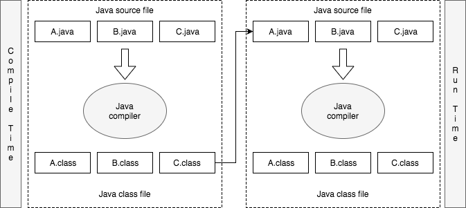
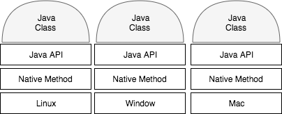

# JAVA VIRTUAL MACHINE

## Java Architecture

#### Compile
- 작성한 코드를 'javac' 명령어로 컴파일하여 class라는 확장자를 가지는 Binary 파일을 생성한다.

#### Class File
- 수행 할 수 있는 파일이 아닌 수행이 가능한 형태의 파일
- 실행을 위해 JRE(Java Rumtime Environment)가 필요

#### Run
- Java Virtual Machine을 하나의 프로세스로 실행
- Class File 로딩
- Class 파일을 분석하여 JRE 내에 있는 Java API(Application Program Interface)와 함께 프로그램 수행

### - The Java Program Language
- object oriented, Multi-Threading, Garbage Collection, Dynamic Linking, Dynamic Extension
- Runtime 메모리 핸들링 방지
- 엄격한 Type Rule

#### Dynamic Linking
- class 파일은 JVM이 읽을 수 있는 형태일 뿐 실행 가능한형태는 아님
- JVM 안에서 실행 가능한 형태로 변형
- 실행을 위한 Linking 작업을 수행해야 함
- class 파일은 실행 시 Link 할수 있도록 Symbolic Reference만을 가지고 있음
- runtime시에 실제 메모리상에있는 물리적인 주소로 대체되는 Linking 작업이 실행됨
- 필요시에만 동적으로 발생하기 때문에 Dynamic Linking이라고 함
- class 파일을 작게 유지 할 수 있음

#### Symbolic Reference
- 참조하고자 하는 대상의 이름만으로 참조관계를 구성
- Class 파일이 JVM에 로딩되면 그 이름에 맞는 객체의 주소를 찾아서 연결

### - The Java Class File Format
- compact, bytecode, platform 독립적, Networ Byte Order 사용
- clss 파일은 Bytecode를 Binary 형태로 담아놓은 것
- Bytecode는 JVM이 읽을 수 있는 언어를 의미
- JVM은 class를 로딩 후 실행이 가능하도록 해석(Interpret)하는 과정을 거침
- 로딩 된 이후에는 Execution Engine을 거쳐 실행(5장에서 자세히 다룸)
- bytecode는 JVM을 위한 언어 --> 'Run EveryWhere'

#### NetworkByteOrder
- ByteOrder : 메모리의 주소 값을 할당하는 방식
- Little Endian , Big Endian
- 다른 CPU간 데이타를 주고받을때 문제가 발생
- 서로 다른 계열의 CPU끼리 데이터를 전송할때 정해진 약속
- Big Endian 사용

출처 : 위키피디아(www.wikipedia.org)

### - The Java Application Interface
- Runtime Library의 집합
- OS 시스템과 JAVA 프로그램을 연결시키는 역할

#### 파일 읽기 예제
- java.io.InputStream을 사용하여 파일을 읽음
- 파일시스템은 OS에 따라 다름(FAT , JFS등)
- java 코드내에 java.io.InputStream의 Symbolic Reference를 이용하여 Runtime Instance에 접근
- File에 대한 접근은 Native Method를 통해 OS에 명령 전달
- OS는 File IO를 수행
- Native Method를 통해 Java API로 전달

### - The Java Virtual Machine(JVM)
- 구현이 아닌 스펙(Specification)
- 표준화된 정의가 나오면 JVM 벤더들은 이에 맞도록 구현
- 정의된 Specification을 구현한 하나의 독자적인 Instance

1. ClassLoaderSystem : Class 파일을 로딩
2. Execution Engine : 로딩된 Class 해석
3. Runtime Data Areas : 해석된 Class 배치
4. Thread Synchronization&GC : 관리 작업