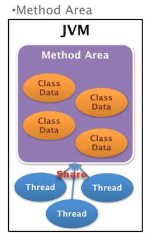
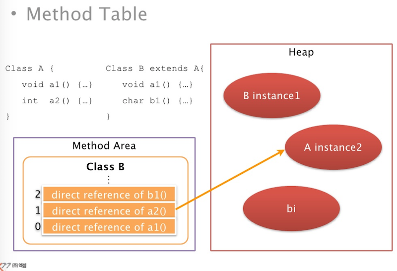
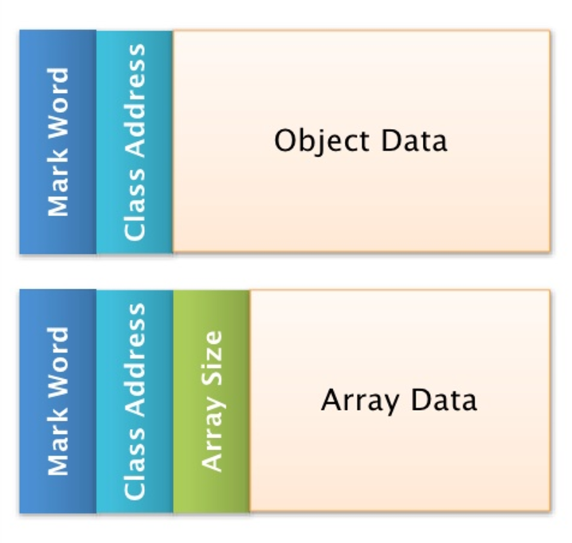
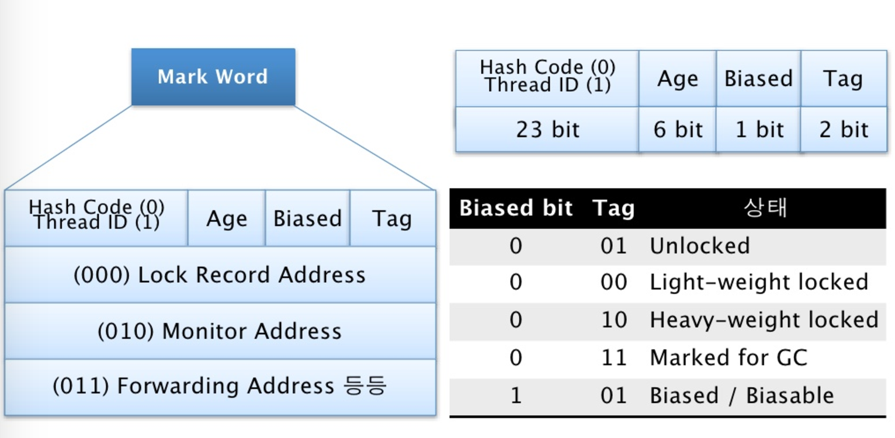
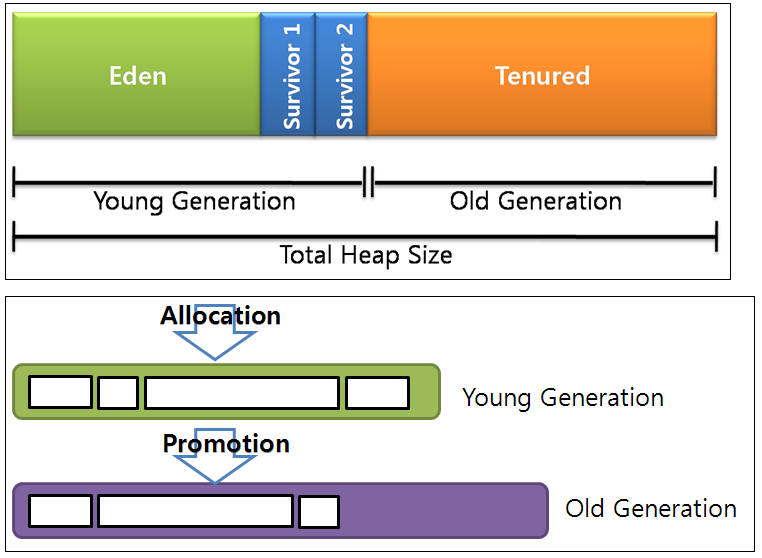

# Runtime Data Areas-02
Runtime Data Areas 2번째 시간으로 Method Area와 Heap 의 구조, Simulation을 해보는 구성으로 준비 하였다.<br>
이번 시간을 통해 전반적인 JVM 동작을 이해하고, Runtime Data Areas를 이해하자.

## Method Area
<br>
출처 [(주)엑셈](http://www.slideshare.net/novathinker/2-runtime-data-areas?qid=cf17e59d-856b-429c-9b7e-6f93b10f987e&v=&b=&from_search=1)

앞시간에 설명했던 내용들과는 다르게 Method Area는 모든 Thread에서 공유하는 메모리 영역이다.<br>
이 메모리 영역은 classLoader에 의해서 로드된 Class나 Interface를 의미하는 <br>
모든 **Type의 메타정보를 저장** 하는 논리적 메모리 공간이다.<br>

Method Area는 JVM이 기동할 때 생성이 되며 Garbege Collection의 대상이 단다.<br>
Hotspot JVM 의 경우 Permanent Area 라는 명칭으로 특정 메모리 영역을 나타내며,<br>
IBM JVM 의 경우 Heap 내에 Class Object 의 형태로 저장된다.<br>
Method Area에 저장되는 Type정보는 아래와 같이 7개의 정보로 구성이 된다.
- Type Information
- Constant Pool
- FieId Information
- Method Information
- Class Variable
- Reference to class classLoader
- Reference to class Class

각각 어떤 내용이 포함되는지 살펴 도보록 하자.

### Type Information
가장 기본이 되는 정보로 Type에 대한 전반적인 내용이 포함된다.
  >여기에서 Type은 Java Class나 Interface를 의미한다는 점 기억하자.

- Type의 전체 이름(Package명 + class명)
- Type의 직계 superclass의 전체이름(Interface 이거나 Object class이거나 없는경우는 제외)
- Type이 class인지 Interface 인지의 여부
- Type의 modifier (public, abstract, final)
- 직접 연관된 Interface의 전체이름 리스트(Package.class)

### Constant Pool
- Constant Pool이란 말 그대로 Type의 모든 Constant 정보를 가짐
- Literal Constant, Type, FieId, Method로의 모든 Symbolic Reference까지 포함
- Constant Pool의 Entry는 Array처럼 index로 접근하는 특징
- Symbolic Reference는 Dynamic Linking의 핵심 요소

### FieId Information
- FieId 이름
- FieId 의 Data Type, 선언된 순서
- Field Modifier (public, private, protected, static, final, volatile, transient)

  Type에서 선언된 모든 FieId가 저장되는 장소이다.<br>
  여기서 FieId는 Member Variable, Class Variable을 의미한다.<br>
  java 에는 4 가지 종류의 변수가 있는데 그것은 각각 Instance Variable, Class Variable, Local Variable, Parameter 이다.<br>
  이중 Field 라 함은 Instance Variable 과 Class Variable 을 의미한다. 이들은 각각 nonstatic field, static field 로 표현되기도 한다.<br>
  그리고 나머지 Local Variable 과 Parameter Variable 은 Method 에 속하는 것으로 Field 와 이들을 포함하여 Variable 이라고 한다.<br>

### Method Information

  Type에서 선언된 모든 Method의 정보가 저장되어 있다.
  Method를 선언한 순서대로 저장되는 특징이 있다.

- Method 이름
- Method 의 Return Type
- Method Parameter수와 Type(순서대로)
- Method Modifier (public, private, protected, static, final, syncronized, native, abstract)

추가적으로 Method가 native나 abstract가 아니라면 다음의 정보가 추가된다.<br>
native : 다른 언어로 작성된 코드를 자바에서 사용하기 위함. method 에만 사용. JNI(java native interface)<br>
- Method 의 Bytecode
- Method Stack Frame 의 Operand Stack 및 Local Variable Section의 크기
- Exception table

### Class Variable
- Class 변수 == Static 변수
- 모든 instance에 공유가 되며, instance가 없어도 접근이 가능하다.
- 이 변수는 instance에 속한것이 아니라 class에 속한다.
- class를 사용하기 이전에 이 변수들은 미리 Method area에 메모리를 할당받는다.
- Class Variable을 final로 선언할 경우 변수로 취급하는게 아닌 상수로 취급한다.(Constant pool에서 Literal Constant로 저장)

### Reference to class classLoader
- 하나의 Type이 다른 Type을 참조할 때 JVM은 동일한 ClassLoader를 사용
- 그렇기 때문에 Type의 Classloader 정보 필요
- User-Defined Classloader 인 경우는 reference를 저장
- Bootstrap Classloader 인 경우는 null
- JVM이 Dynamic Linking시 이 정보를 이용하여 참조하는 Class를 같은 Classloader를 통하여 Load 한다.

### Reference to class Class
- 각 Type이 JVM에 Load 되면 java.lang.class의 instance가 하나씩 생성된다.
- Method Area 에서 Type정보의 일부로 이 instance의 Reference를 저장하고 있다가 반환해준다. (getClass, forClass, isInterface)

### Method Table
지금까지는 Method area에 저장되는 각종 정보에 대해 알아보았다.<br>
java는 캡슐화된 각 객체를 이용하는 프로그래밍 언어이기 때문에 Reference를 통하여 <br>
객체를 찾아 다니는 일은 프로그램 수행중에 가장 빈번히 일어나는 일일 것이다.<br>
Method area내에서 원하는 정보를 찾는 속도 성능 개선을 위한 Method Table이라는 자료구조를 사용하였다.<br>

- Class의 Method들에 대한 direct reference를 갖는 자료구조
- Method 호출을 위한 데이터 구조
- Method 참조를 빠르게 수행
- Type중 interface 나 abstract class가 아닌 class에 존재
- superclass에서 상속된  Method Constant reference 도 포함됨
- Class가 Loading 되는 시점 생성

<br>
출처 [(주)엑셈](http://www.slideshare.net/novathinker/2-runtime-data-areas?qid=cf17e59d-856b-429c-9b7e-6f93b10f987e&v=&b=&from_search=1)

## Java Heap
- Object나 Array가 저장되는 공간
- 모든 Thread가 공유
- JVM Heap에 메모리를 할당하는 instruction만 존재 (new, newarray, anewarray, multianewarray)
- 메모리 해제를 위한 어떤 java code나 byte code도 존재하지 않음
- 메모리 해제는 오직 GC를 통하여 수행
- Java Heap의 구현은 Vender의 재량
  - 각 JVM Vender마다 Heap 구조 및 Garbage Collection, Garbage Collector가 다름

### Object Layout
- Heap 에 저장되는 Object나 Array는 모두 Header와 Data로 되어있다.
- Header는 보통 고정크기로 Object의 앞 부분에 위치하고 그 뒤로 가변 크기의 Data가 들어감

#### Hotspot JVM Object Layout
- Object는 2개의 Header를 가진다.(Mark Word, Class Address)
- Array의 경우는 3개의 Header를 가진다.(size를 표현하는 Header 추가)
- Header의 크기는 1 Word (32bit: 4Byte, 64bit: 8Byte)

<br>
출처 [(주)엑셈](http://www.slideshare.net/novathinker/2-runtime-data-areas?qid=cf17e59d-856b-429c-9b7e-6f93b10f987e&v=&b=&from_search=1)

First header는 Mark Word라고도 불리며, Garbage Collection, Synchronization 작업을 위해 사용한다.<br>
Hash Code/Thread ID, Age, Biased Bit, Tag Flag 로 구성되며,<br>
아래 그림과 같은 Layout 으로 구성이 된다.

<br>
출처 [(주)엑셈](http://www.slideshare.net/novathinker/2-runtime-data-areas?qid=cf17e59d-856b-429c-9b7e-6f93b10f987e&v=&b=&from_search=1)

- Hash Code or Thread ID: 23 Bits를 할당 받고 있으며, Biased Bit와 Tag에 따라 값이 결정된다.
- Biased Bits:
    - 1이면 Biased Lock을 획득한 Thread ID가 표기
    - 0이면 Biased Lock을 사용하지 않음을 나타냄
- Age 는 6Bits로 Young Generation의 Object Even과 Survivor를 넘나든 횟수를 기록한다. 이는 Max Tenure의 값을 결정하는 것과 연관이 있다.


second header에는 Method Area의 class정보를 가르키는 reference정보가 저장된다.
이렇게 두개의 header는 동일하나 Array의 경우 Array size를 위한 header가 하나 추가된다.

## Heap 의 구조

### Hotspot JVM 의 Heap 구조
- Generational Heap 으로 Young Generation, Old Generation 로 나눠져 있다.
- Young Generation 은 Eden 영역과 Survivor 영역으로 구성된다.
- Eden 영역은 Object 가 Heap 에 최초로 할당되는 장소이다.
- Eden Area 가 꽉 차면 Object 의 참조가 Live Object 이면 Survivor 영역으로 이동한다.
- 참조가 끊어진 Garbage Object 이면 잔류한다.
- 모든 Live Object 가 Survivor 영역으로 넘어가면 Eden 영역을 청소(Scavenge) 한다.
- Survivor 영역은 Eden 영역에서 살아남은 Object들이 잠시 기거하는 곳이다.
- Old Generation 은 Object가 Allocation 되는 것이 아니라 Promotion된다.<br>
 (즉 새로 Heap에 생성되는 Object가 들어오는 것이 아니라 비교적 오랜 시간동안 참조 되고 이용되어 <br>
   앞으로도 계속 Heap에 머무를 확률이 높은 Object를 남겨놓게 된다.)

<br>
출처 [(주)엑셈](http://www.slideshare.net/novathinker/2-runtime-data-areas?qid=cf17e59d-856b-429c-9b7e-6f93b10f987e&v=&b=&from_search=1)


## Simulation
배운거를 실습할 시간이다.<br>
우선 java의 변수부터 구분지어 보도록 하자.
- Class Variables
- Member Variables
- Paramether Variables
- Local Variables

### Class Variables
Class Variables은 흔히 Static 변수라는 명칭으로 사용이 된다.<br>
Static은 Class변수 이니 Class Variables은 Method Area에 할당 받는다.<br>
당연히 모든 Thread에 의해 공유 받는다.

### Member Variables
Menber Variables은 Instance 변수라는 별명을 가지고 있다.<br>
Menber Variables은 Instance에 속해있기 때문에 정확한 별명이라고 볼수 있다.<br>
Instance는 Member Area를 바탕으로 Heap에 생성 된다.

### Paramether Variables
Paramether Variable은 Method의 인수를 의미한다.<br>
변수의 정보는 Method Area의 Method Information 에 포함되고,<br>
Paramether Variable은 JVM Stacks에 할당 된다.

### Local Variables
Local Variables은 Paramether Variables과 동일하다.<br>
차이점은 Local Variables Method내에서  정의 된다는 것이다.

```java
class VariableArrange {
  static int ci = 3;                // Class Variables
  static String cs = "Static";      // Class Variables
  int mi = 4;                       // Member Variables
  String ms = "Member";             // Member Variables

  void method(int pi, String ps) {  // Paramether Variables
    int li = 5;                     // Local Variables
    String ls = "Local";            // Local Variables
  }
}
```

이 예제는 종류별로 두개씩 Primitive Type 과 Reference Type 으로 선언이 되어 있다.<br>
그림으로 보면 아래와 같을 것이다.<br>
<br>
Primitive Type인 int 대신 Interger를 사용 하였다면 어떠하였겠는가?<br>
Class Variables 영역에 3이라는 값 대신 Reference로 대치되어 있을 것이고,<br>
이 Reference는 Heap에 생성된 Interger class의 Instance를 가르키고 잇을 것이다.<br>

>아직 잘 흐름이 눈에 안들어 온다고 해서 걱정하지 말아라. 이제 하나씩 천천히 흐름을 눈에 익혀보자.

아래는 Test class의 메모리에 할당 되고 제거 되는 흐름을 나태내기 위한 예제이다.
```java
/**
 main() method와
 add() method 한개,
 static변수(클래스 변수) 한개로 구성
*/
class Test    
{
     static int total = 0;

     public static void main(String[] args) {
          int x = 10, y = 20, z;    
          z = add(x,y);
     }

     static int add(int a, int b) {
          total++;     
          return (a+b);
     }
}
```
class파일이 classLoader에 의해 메모리에 로드 되었을때의 구조는 아래와 같을 것이다.(초기화 상태)
<br>
해당 클래스의 로딩이 끝난후 JVM 은 main()을 호출할 것이고,<br>
main() 안의 지역변수 x,y,z 가 초기화 될 것이다.<br>
순서대로 스택에 쌓이게 될것이다.
<br>
이제 add()가 호출될 차례이다.<br>
add method가 호출되면 stack frame에 할당되고, <br>
그 다음 매개변수인 a,b에 대한 값이 쌓인다.(마치 배열과 같다.)<br>
또한 method area의 total도 증가 되었다.<br>
<br>
이제 add() method가 return 값을 반환하고, JVM에서는 stack frame에서<br>
사용안하는 add frame을 제거한다.<br>
<br>

JVM은 프로그램의 실행 순서에 따라 메서드에 해당하는 스택 프레임을 할당하고 해제하는 일을 반복한다.<br>
즉 메서드가 호출되면 새로운 스택 프레임이 할당되어 사용된 후 메서드의 수행이 끝나고 반환시에 스택에서 제거하게된다.<br>
이런 흐름을 알았다면 이제 실습예제의 확장판을 살펴보자.

```java
class JvmInternal {
  static int cv = 0;
  final static int fcv = 100;

  public static void main(String[] args) {
    int a, b, c;
    a = integer.parseInt(args[0]);
    b = integer.parseInt(args[1]);
    c = addTwoArgs(a,b);
  }

  static int addTwoArgs(int x, int y) {
    cv = fcv;
    return (x + y);
  }
}
```

위의 실습 예제를 수행하기 위해서는 우선 ClassLoader에 의해 로딩 과정이 일어날 것이다.
class가 로딩되면서 일어나는 일들을 살펴보면<br>
1. Method Area에 class정보가 올라간후<br>
2. Heap에 JvmInternal Instance가 하나 생성이 될것이다.<br>
3. Java Stack에서는 이를 수행하기 위한 Stack Frame이 생성이 된다.<br>

<br>
여기에서 살펴봐야 할점은 static 으로 선언한 cv의 값은 Class Variables에 들어가 있지만,<br>
final static으로 선언한 fcv는 상수화 되어 버리기 때문에 Constant Pool에 들어가 있다는 점이다.

이제 적재된 JvmInternal의 main() 메소드를 실행할 차례이다.<br>
1. main() method가 실행이 되면 이 method에 해당하는 Java Stack에 새로운 Stack Frame이 생성 된다.<br>
2. method가 실행이 되면서 args[] Reference 데이터를 그대로 넘겨 준다.<br>
3. Stack Frame이 크가가 다른 이유는 생성되는 method의 정보를 바탕으로 생성이 되기 때문이다.

<br>

이제 main() method를 생성하고 실제 작업에 들어가 보도록 하자.<br>
1. 가정먼저 수행되는 부분은 Local Variable인 a,b,c를 선언한다.<br>
2. method의 parameter로 제공되는 args[0]의 값을 String -> int로 변형하여 저장하는 과정이다.

```java
  a = integer.parseInt(args[0]);
```
<br>

이제 parseInt의 Method Parameter가 마련되었다.<br>
1. Integer객체를 찾아 parseInt() Method를 수행한다.<br>
2. operand stack의 값 '10'이 parseInt()를 통하여 10 으로 변경이 되고 Local Variable Section의 1번 인덱스에 저장된다.

<br>

b 도 동일한 과정을 거쳐서 Local Variable 2번 인덱스에 저장이 된다.<br>
그 다음 과정은 addTwoArgs() method 이다.
```java
  c = addTwoArgs(a,b);
```
a,b는 이미 Local Variable에 들어가 있는 변수 a,b의 값을 인자로 받는 형태이기 때문이다.<br>
1. Local Variable에 저장되어 있는 a,b를 Operand stack으로 옮겨준다.<br>
2. 이 값들을 인수로 하여 addTwoArgs() method를 호출해 준다.<br>
3. addTwoArgs() method의 Stack Frame이 Push된다.

<br>

이제 addTwoArgs() method의 cv = fcv 의 연산을 표현한 것이다. (p75)<br>
1. fcv의 값을 Frame Data의 fcv주소를 통하여 접근한다.<br>
2. 이 값을 Operand stack으로 Pop하여 저장한다.<br>
3. Thread는 Class Variable의 cv로 접근하여 100이라는 값을 얻어 변경한다.

<br>

이번 작업은 인수로 넘어온 x,y를 더하여 반환하는 작업을 할 차례이다.<br>
1. Local Variable에서 인덱스를 통하여 Operand stack으로 Push한다.<br>
2. 이 두 값을 Pop하여 iadd를 통하여 연산해 준후 결과값을 Operand stack에 다시 Push한다.<br>
3. return으로 반환값 반환 -> main()의 Operand stack으로 Push된다.<br>
4. addTwoArgs() method의 Stack Frame에서의 작업이 완료 되었으므로 Java Stack에서 사라진다.<br>
5. 이제 addTwoArgs() 반환값을 Pop하여 Local Variable 3번째 인덱스로 Push한다.

>iadd : int형의 값을 더함. Operand Stack 값들이 모두 Pop되어 연산에 사용. 결과를 Push
>return : Method의 수행을 마치고 Stack Fraem을 나감

<br>
<br>

## 마치며
지금까지 Runtime Data Areas에 대해 알아 보았다.<br>
기초 지식을 기반으로 JVM 동작을 이해하고,성능을 향상시키는 (불필요한 Reference) 프로그래머가 되도록 노력 하자.
