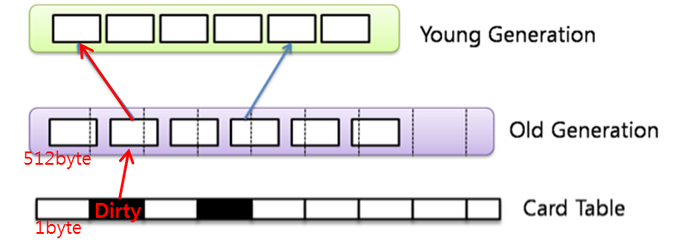

# Hotspot JVM

### 기본 구조 및 Hotspot의 특징

* **Hotspot JVM의 Heap 구조**
    * Object의 할당순서 : Eden -> Survivor -> Old generation
    * GC의 대상 : Eden, Survivor, Tenured

    * http://www.javaworld.com/article/2073905/build-ci-sdlc/pick-up-performance-with-generational-garbage-collection.html

* **1) Young Generation 영역의 Fast Allocation**
    * Bumpt the Pointer : 할당된 메모리의 바로 뒤에 메모리를 할당
    * TLAB : 쓰레드마다 할당을 위한 주소의 범위를 부여
    
      > ** TLAB의 장단점 **  
      > 장점 : 멀티쓰레드 메모리 할당 과정에서의 Lock 및 Wait 이슈 없이 할당 가능  
      > 단점 : Thread에게 영역을 최초로 할당하거나, TLAB이 부족하여 새로 할당을 할 시에는 동기화 이슈 발생. 하지만 전체적으로는 Object Allocation에 비해 더 짧은 시간 내 수행  

* **2) Weak Generational Hypothesis**
    * Heap을 Young, Old Generation으로 나누어 구성하는 이유
    * Generational Algorithm
    * 경험적 지식과 가설에 기반함
      1. *높은 유아사망률* : Object는 새로 생성된 후 얼마 되지 않아 Garbage가 되며, 새로 할당된 Object가 모인 곳은 Fragmentation 확률이 높다.
      2. *Old Object가 Young Object를 참조하는 일은 적다* : 이 경우가 많다면 RootSet에서 참조관계를 Marking할때의 JVM suspend 상태가 길어진다.

* **3) Old Generation GC Algorighm**
    * Old Object가 Young Object를 참조하는 일은 드물지만 발생한다.
    * Hotspot JVM은 **Card Table / Write Barrier** 를 사용
    
    > **Card Table** : Old generatino 메모리를 대표하는 별도의 메모리. Reference가 있을시 dirty로 표기  
    > **Write Barrier** : Old Object가 Young Object로 reference가 생길 때 실행되어, card에 dirty를 표시하거나 지우는 작업을 수행  
    * Minor GC 도중의 Old->Young의 참조 정보는 Card Table의 Dirty만 검색하면 됨

* **4) Application별 GC 별도 적용**
    * Server / Client Application을 나누어 각각에 적합하게 GC 수행
    * 하드웨어와 OS 기준으로 자동으로 구분
    * 각각의 경우에 맞도록 **Collector 및 Compiler**를 자동 선택하나, 옵션을 통해 조정가능
    * **Server** : 대용량의 Heap을 사용하여 처리량이 많은 application 패턴 처리
      > 2개 이상의 CPU, 2GB 이상의 메모리, 32bit 윈도우 제외  
      > Parallel Collector, Server Runtime Compiler  
      > Initial Heap Size : 1/64 * physical memory (~1GB), 32MB(1GB~)  
      > Max Heap Size : 1/4 * physical memory (~1GB)  
      > http://docs.oracle.com/javase/7/docs/technotes/guides/vm/  
      > http://docs.oracle.com/javase/7/docs/technotes/guides/vm/server-class.html
    * **Client** : 적은 Heap과 실시간성 application 패턴의 GC 및 Heap Sizing 처리
      > 서버로 분류되지 않는 경우  
      > Serial Collector, Client Runtime Compiler
      > Initial Heap Size : 4MB  
      > Max Heap Size : 64MB

### Hotspot JVM의 Garbage Collection
  * **Minor GC**
    * Young Generation의 Garbage Collection
    * Object 할당 과정 중 메모리 압박이 생겼을 때 수행
  * **Major GC(=Full GC)**
    * Old Generation의 Garbage Collection
    * Object의 Promotion 과정 중, Old 영역의 메모리 압박이 생겼을 때 수행
    * Permanent Area의 메모리 압박 발생 시에도 수행
      * Heap에 메모리 공간이 충분하더라도, 너무 많은 Class Object가 로딩될 때 수행된다.
  * **Major GC가 성능에 악영향인 이유**
    * GC는 JVM의 suspend를 발생시키며, Major GC는 그 시간이 더 길다
    * 메모리의 재활용은 반드시 필요하므로, GC 자체가 문제가 아니다
    * Application의 불필요한 작업으로 인한 GC와, 어울리지 않는 collector나 heap sizing이 문제가 될 수 있다

## Hostpot JVM의 Option

### Hotspot JVM의 option의 종류

  * Standard Option
    * 모든 JVM 공통
    * Option 앞에 '-'만 붙는 것
  * Non-Standard Option
    * JVM마다, 버전마다 다른 옵션
    * 설정 또는 성능 개선을 위한 목적
    * Hotspot JVM은 -X, -XX 두가지로 구분
    * '-X' 옵션
      * Macro 한 부분 제어 (큰, 전체적인 부분)
    * '-XX' 옵션
      * Micro 한 부분 제어
      

### Hotspot JVM의 Heap Sizing Option

## Hotspot JVM의 Garbage Collector

* Garbage Collector의 중요성
  * Hostpot JVM에서 Garbage Collector를 이용하는 것은 Garbage Collection 자체를 이해하는 것이다.
  * GC를 최적화 한다는 것은, 적절한 Garbage Collector를 선택하는 것 이외에 방법이 없다.
  * Hostpot JVM Garbage Collector의 종류
  

### Garbage Collector 훝어보기
  * **Serial Collector**
    * Hotspot JVM의 가장 기본적인 collector.
    * IT의 발전으로 Heap 사이즈가 점점 커지며 한계가 드러남
    * ex) Heap이 커질수록 늘어나는 suspend 현상
    * 두 가지 전략으로 분화
      * 1) 모든 리소스를 투입하여 빨리 끝내자 : 병렬(Parallel) 방법 채택
      * 2) suspend를 분산시켜 체감을 줄이자 : 실시간 application에 맞음. GC 동시에 app 작업도 수행
  * **Parellel Collector**
    * 처리량 위주의 collector
    * Young 영역을 병렬 처리하여 처리량을 늘림
    * Young 영역의 알고리즘을 parallel copy로 대체하나 Old는 그대로 유지
  * **Parellel Compacting Collector**
    * Young에서만 사용하던 parellel 기법을 Old에서도 적용.
  * **Concurrent Mark-Sweep Collector**
    * 응답시간 개선에 집중
  * **Incremental Collector** (=Train Collector)
    * 공식적으로 지원 중단
  * **Garbage First Collector**
    * Train Algorithm의 아이디어 기반
    * suspend 체감을 줄이는 것 뿐만이 아닌 아에 realtime에 가깝게 줄이자
    * generation을 물리적으로 구분하는 것이 아닌 용도에 따라 구분

### Serial Collector
  * Young, Old GC 전부를 serial하게 싱글CPU를 사용하여 처리 (=1개의 쓰레드로 GC 수행)
  * Client Class의 기본 collector
  * **Minor GC의 수행과정** (Young Generation - Generational Algorithm)
    * Young이 꽉 참 -> JVM Suspend -> Object Mark -> Collection -> Promotion -> Scavenge -> suspend 해제
    * img
    * http://www.slideshare.net/novathinker/3-garbage-collection (111p)
    * Survivor 영역(To-From)은 논리적인 영역으로, minor GC때마다 서로 바뀐다.
    * Object는 Survivor 영역(To-From)을 이동하며, header에 age를 기록한다.
    * 설정한 횟수 이상으로 이동하기 전까지 Young 영역에 남아있게 됨.
    * Object의 age Header는 6bit이므로, 최대 31까지 가능.
  * **Full GC의 수행과정** (Old Generation : Mark-and-Compacting Algorithm)
    * Mark Phase, Sweep Phase 2가지로 진행
    * Promotion 수행 -> 공간부족 -> Suspend -> Object Mark -> Object Sweep -> Object Compaction -> Suspend 해제
    * img
    * http://www.slideshare.net/novathinker/3-garbage-collection (116p)

### Incremental Collector
  * suspend 분산을 위한 최초의 Collector
  * **Minor GC의 수행과정**
    * Serial Collector와 동일 (Generational Algorithm)
  * **Full GC의 수행과정** (Train Algorithm)
    * Old 영역을 64kbytes의 블록으로 나누고, 각각 블록을 대상으로 GC 수행
    * Minor GC 발생시마다 연속해서 수행됨.
    * Train algorithm 자체가 copy를 전제로 하므로, GC도중 옮겨놓을 메모리가 필요함.
    * GC 과정에서 OutOfMemory 발생시 Mark-and-Compaction Algorithm으로 전환하여 처리
    * img
    * JAVA6에서부터 사라짐
      * 각 블록을 가득 차게 쓰기 힘들기 때문에, Fragmentation 현상이 많음.
      * Memory Block을 선택하는 과정이 Overhead
      * Remember Set(train 외부 참조) 공간에 대한 Overhead

### Parallel Collector
  * JAVA 1.4에서 등장
  * Single Thread가 아닌 많은 Multi Thread를 사용하여 GC시간 단축
  * 싱글 CPU 환경에서는 자동으로 Serial Collector로 전환되어 동작
  * **Minor GC의 수행과정** (Parallel Copy)
    * Generational Algorithm과 동일하나, 여러 Thread가 동시에 수행하여 suspend 시간 단축
    * img
    * 여러 Thread 접근시의 동기화 문제가 발생 가능. 이 경우 Promotion의 성능이 하락.
    * Hotspot JVM은 이를 위해 PLAB(Parallel Local Allocation Buffer)이라는 Promotion Buffer를 적용
    * img
    * Promotion 시에 배타적으로 사용하기 위해, Thread마다 Old 영역의 일정 부분을 할당해 놓는 작업
    * Thread가 할당받은 Buffer를 사용하지 않거나, 자투리 공간이 발생할 경우 Fragmentation 문제가 생길 수 있다.
    * PLAB vs TLAB
      * PLAB : Promotion 과정의 동기화 문제 회피
      * TLAB : Young 영역의 Fast Allocation
  * **Full GC의 수행과정** (Mark-and-Compacting Algorithm)
    * Serial Collector와 동일

### CMS Collector
  * JAVA 1.4에서 Parallel Collector와 함께 소개
  * Parallel이 '빨리 끝내기' 를 목적으로 한다면, CMS는 suspend를 줄이는 데 집중
  * 자원이 여유가 있는 상태에서 suspend time을 줄이는 목적에 적합.
  * Size가 큰 Long-lived Object가 있을 경우 적합.
  * **Minor GC의 수행과정** (Parallel Copy)
    * Parallel Collector와 동일
  * **Full GC의 수행과정** (Concurrent Mark-Sweep Algorithm)
    * 4개의 단계로 구성
    
    * sweep img(동철님)
  * **Freelist**
    * Promotion 과정에서의 Fragmentation 방지
    * 1) Young Generation에서 Promotion된 Object와 비슷한 크기의 Free Space 탐색
    * 2) Fragmentation 방지를 위해 Promotion Object의 크기를 통계화하여 미래의 요구량 측정
    * 3) 추정된 양에 대해 Free Memory 블록을 붙이거나 쪼갬
    * 4) 가장 적절한 사이즈의 Free Memory 구역에 Object 할당
  * **Freelist vs Compaction**
    * Freelist : Fragmentation 가능성은 줄이나, Compaction에 비해 GC 중 Young 영역의 부담 가중
    * Compaction : Promotion 과정에서 할당영역을 찾을 필요 없이 순서대로 할당하면 됨.
    * Object가 Young 영역에 잔류하는 시간은 길어지나, Compaction은 고비용이므로 전체적으로는 더 좋을 수 있음 (ex. Promotion이 빈번하지 않은 경우)
  * **Floating Garbage**
    * Garbage면서 수거되지 않은 Garbage
    * Concurrent Mark 단계에서 Promotion되어 Garbage가 된 Object
    * img
    * 다음 번 GC때 처리되나, GC 완료 시점에 처리가 완벽하게 되지 않는다.
    * Heap Memory(Old Generation) 영역의 확장으로 이어짐
  * **Scheduling**
    * Collection의 스케쥴 설정
    * Minor GC와 Remark Phase가 연달아 수행되는 것 방지
    * Old Generation이 꽉 차기 전에 GC 수행
    * GC 시간, Old가 꽉 차기까지 남아있느 ㄴ시간을 계속 수집하고 체크하여 스케쥴링

### Parallel Compaction Collector
  * JAVA 5 Upgrade 6 버전에서 소개
  * Multi CPU에서 유리
  * Old 영역 GC 시간을 감소시켜 효율 증가
  * **Minor GC의 수행과정** (Parallel Copy Algorithm)
    * Parallel Collector, CMS Collector 와 동일
  * **Full GC의 수행과정** (Parallel Compaction Algorithm)
    * Mark, Summary, Compaction 3 단계로 진행
    
  * **1) Mark Phase**
    * Parellel로 수행
    * Old Generation을 Region이라는 단위로 균일하게 나눔
    * Thread는 각 Region별로 Live Object를 마킹
    * 마킹 시점에 Live Object의 사이즈, 위치 등의 정보 갱신 => Rgion별 통계를 낼 때 사용
    * img
  * **2) Summary Phase**
    * Single Thread로 동작하지만, 그 외는 Application 수행
    * Mark단계의 결과를 대상으로 처리하므로 한 쓰레드만 처리가 가능
    * Region 단위로 작업을 수행
    * Region 통계 정보를 바탕으로 각각의 Density 판단(Region별 Reachable Objec의 밀도)
    * 판단된 Density 기준으로 Dense Prefix 설정 (Reachable Object의 대부분이 Region의 어디까지인지 구분)
      * 정해진 Dense Prefix의 좌측은 GC에서 제외되고, 나머지만 Compaction (Sliding Compaction)
      * 오랜 기간 참조되는 Object는 좌측에 집중되므로 gabage가 되지 않을 확률이 높다
    * Dense Prefix 설정 후, Compaction 대상이 되는 Region의 첫 주소를 찾아 저장하고 phase 종료.
    * img
  * **3) Compaction Phase**
    * Heap Suspend. 모든 Thread가 Region을 할당받아 작업 수행
    * Garbage의 Sweep 처리 (Reachable Object를 왼편으로)
      * Dense 이후의 Region을 Destination, Source를 구분하여 작업 수행
      * Live Object를 어디에서 어디로 옮길 것인지 판단
    * img

### Garbage First Collector
  * JAVA 6 Update 14에 포함. 가장 최신의 Collector
  * 기존처럼 Young-Old로 구분하는 방식의 장단점
    * 장점 : 대부분 Object는 짧은 생애를 가지므로 Young에 집중 가능
    * 단점 : Old Generation의 Fragmentation, Freelist 사용, suspend time 증가 -> suspend하고 빨리 처리하는 compaction 방식으로 회귀
  * Garbage로 꽉 차 있는 Region부터 GC를 시작한다 -> Garbage First
  * 물리적인 Generation의 구분을 없애고 Heap을 1~32Mbytes 단위의 Region으로 재편
  * Young - Old의 개념을 논리적으로 바꿔버림
    * Young Generation : Object가 새로 Allocation되는 Region의 집합
    * Old Generation : Object가 Promotion되는 Region의 집합
  * **전체 Flow**
    * img
    * G1 Garbage Collector Step by Step
      * http://www.oracle.com/technetwork/tutorials/tutorials-1876574.html
  * **Minor GC**
    * 1) Young Region 대상으로 Reachable Object 찾음
    * 2) age가 되지 않는 Object는 Survivor Region으로 Copy
    * 3) Promotion 대상은 Old Generation Region으로 Copy
    * 4) 기존 Young Region은 garbage로 간주하여 해지
    * 5) Young Collection 이후 바로 Old Collection 실행
    * 
    * http://www.oracle.com/technetwork/tutorials/tutorials-1876574.html
    * 기존 Collector처럼 Heap 전체로 처리하는 것이 아닌, Region 단위로 Collection 실행
    * suspend를 해당 region을 사용하는 쓰레드만으로 제한할 수 있음
  * **Full GC**
    * 
    * http://www.oracle.com/technetwork/tutorials/tutorials-1876574.html
