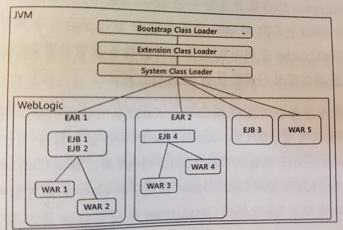

# JVM Class Loader
## 1. Class Loader
### Class Loader 정의

- 클래스 로더는 컴파일 시점이 아닌 실행시점에 클래스를 로딩할 수 있게 해주는 기술이다.
- Dynamic Loading : 참조되는 순간 동적으로 Load 및 Link(적절한 배치) 가 이뤄진다.
- 자바의 큰 장점 중 하나이다.

#### > Dynamic Loading 이란?
- 클래스 로드가 어느 시점에 수행되는지에 따라 아래와 같이 구분된다.

<table>
	<tr>
	<td>구분</td>
	<td>특징</td>
	<td>소스코드</td>
	</tr>
	<tr>
	<td> LoadTime Dynamic Loading </td>
	<td>하나의 클래스를 로드 할 때 <br>
	이에 관련된 클래스들을 한꺼번에 로딩한다</td>
	<td>
    public class Hello { <br>
     public static void main (**String**[] args) { <br>
        **System**.out.println("Hello Exem"); <br>
     } <br>
    } <br>
		- java.lang.String <br>
		- java.lang.System
	</td>
	</tr>
	<tr>
	<td>Runtime Dynamic Loading</td>
	<td>소스코드에서 객체를 참조하는 순간에 동적으로 로딩한다</td>
	<td>
      public class Hello {<br>
       public static void main (String[] args) {<br>
          Class cl = Class.forName(args[0]);<br>
       }<br>
      }<br>

		- 어떤 클래스를 로드해야 할 지는 인수로 넘어온 이후에나 알 수 있다. <br>
		- Reflection이라는 기술의 기본.
	</td>
	</tr>
</table>

[표1. Load 시점에 따른 Dynamic Loading 분류]

### Class Loader 특징
#### Namespace (클래스 로더 이름)

```
JVM은 동일한 클래스를 중복 로딩하지 않는다.
그렇기 때문에 클래스를 로드 하기 전 해당 클래스가 JVM에 이미 로드 되어 있는지 확인 하는 과정이 필요하다.
이 과정에서 클래스를 구별하는 방법에 Namespace를 이용한다.
```

- Class 이름 : Package Name + Class Name 으로 구별한다. <br>
**Full Qualified Name : Package Name.Class Name (ex> com.nhncorp.ClassLoader)**
- 클래스로더 에서의 클래스<br>
**Class Loader Name + Package Name + Class Name** 까지 동일해야 같은 클래스라고 인식한다.

아래 그림은 ClassLoader 1, 2 에서 exem.package.jvmclass를 로드하려고 하는 상황이다. <br>
자신이 로드한 클래스의 Full Qualified Name 을 저장한다. <br>
같은 클래스라도 클래스로더만 다르면 중복해서 로드가 가능하다.


[그림1. Namespace와 Class의 Load]


**클래스로더 규칙) <br>
자신이 참조하는 클래스를 로드할 때는 반드시 참조하는 클래스와 참조되는 클래스가 동일한 클래스로더를 사용해야만 한다.**

아래 그림은 exemHelloClass를 수행할 때 Class Loader 에서 발생하는 상황이다.


[그림2. 참조관계가 있는 Class들 로딩시 Class Loader의 동작방법]

#### Class Loader Delefation Model

```
JVM의 수많은 클래스 로더는 위계구조, 계층구조를 가지고 있으며
Class Loader Delegation Model은 이러한 구조를 바탕으로 서로에게 임무를 위임(Delegation) 한다.
```


[그림3. Class Loader의 위계 구조]

- 부트스트랩(Bootstrap) Class Loader <br>
: 부모를 가지지 않는 가장 상위의 클래스로더 이며 JVM이 실행될 때 가장먼저 생성된다. <br>
: Object 클래스를 포함한 Java API($JAVA_HOME/jre/lib/rt.jar)를 로드한다. <br>
: 다른 클래스 로더와 달리 자바가 아닌 네이티브 코드로 구현되어 있다.<br>
: Java를 수행하기 위한 런타임환경을 구성하는 기초단계이다.

- 확장(Extensions) Class Loader <br>
: 부트스트랩(Bootstrap) Class Loader를 부모로 하고, JAVA 확장 클래스들 ($JAVA_HOME/lib/ext/\*.jar)을 로드한다. <br>
: 별도의 클래스 패스(class path)에 설정되어 있지 않아도 로드한다. <br>
: 다양한 보안 확장 기능 들을 로드한다.

- 시스템(System) Class Loader <br>
: 클래스 패스 (class path)에 정의되거나 JVM 옵션에서 -cp, -classpath에 지정된 클래스들이 로드된다. <br>
: 사용자가 지정한 $CLASS PATH 내의 클래스들을 로드한다. <br>
: JVM에서 **Default** 로 사용하는 클래스로더이다. <br>
(사용자 정의 클래스로더를 생성할 때 별도의 Parent를 지정하지 않으면 시스템 클래스 로더가 부모가 된다.)

- 사용자 정의(User-Defined) Class Loader <br>
: 애플리케이션 사용자가 직접 코드상에서 생성해서 사용하는 클래스 로더이다. <br>

[ex]
``` java
URL url = new URL("file:C:/intellij9-workspace/springsprout2/test/sandbox/classloader");
URLClassLoader uCL1 = new URLClassLoader(new URL[]{url});
Class whiteshipClass1 = uCL1.loadClass("sandbox.classloader.Whiteship");
```

``` java
ClassLoader loader = new NetworkClassLoader(host, port);
Object main = loader.loadClass("Main", true).newInstance();
```

클래스의 로드과정) 클래스로더가 클래스 로드를 요청 받음 <br>
**STEP 1.** 상위클래스로더를 거슬러 올라가며 이미 로딩되어 있는지 확인한다. (Bootstrap까지..)<br>
**STEP 2.** 자기 자신 클래스에도 이미 로딩되어 있는지 확인한다.<br>
**STEP 3.** 로딩이 안되어 있으면 요청받은 클래스 로더가 파일 시스템(CLASS PATH 기준)에서 해당 클래스를 찾는다.<br>
**STEP 4.** 그래도 못찾으면 **ClassNotFound Exception** 이 발생한다.<br>

[클래스 로더 소스코드 ; loadClass(), findClass()]

클래스로더가 로드요청을 받으면 내부적으로 loadClass() 메소드 수행된다.<br>
[기본동작]
- 클래스가 이미 로드되어 있으면 이를 반환한다.
- 그렇지 않으면 Parent Class Loader에게 위임한다.
- Parent Class Loader도 클래스를 로드하지 않았다면 findClass() 메소드 호출한다.

``` java
protected synchronized Class<?> loadClass
    (String name, boolean resolve)
    throws ClassNotFoundException{

    // 클래스가 이미 로드되어 있는지 확인
    Class c = findLoadedClass(name);
    if (c == null) {
        try {
            if (parent != null) {
              // Parent Class Loader에게 위임
                c = parent.loadClass(name, false);
            } else {
                c = findBootstrapClass0(name);
            }
        } catch (ClassNotFoundException e) {
            // Parent Class Loader도 클래스를 로드하지 않았다면 findClass() 메소드 호출
            c = findClass(name);
        }
    }
    if (resolve) {
	    resolveClass(c);
    }
    return c;
}
```

Class loader가 직접 파일 시스템을 탐색하여 클래스를 로드한다.

``` java
public Class findClass(String name)throws
    ClassNotFoundException{

    byte[] classBytes = findClassBytes(name);
    if (classBytes==null){
        throw new ClassNotFoundException();
    }
    else{
      //바이트 배열을 인스턴스로 변환한다.
      //Class.newInstance를 사용하여 그렇게 새로 정의된 클래스 인스턴스를 만들 수 있다.
        return defineClass(name, classBytes,
            0, classBytes.length);
    }
}
```
### 웹로직(WebLogic) 클래스 로더 이해
```
웹로직 클래스 로더는 사용자 정의(User-defined) 클래스 로더라고 할 수 있다.
바로 위 부모 클래스 로더는 시스템 클래스 로더이다.
```

Class Loader Tree <br>
: WAS는 EJB모듈과 WAR모듈을 배포하기위한 클래스로더를 구성하고, 이들 또한 계층구조를 확장한 Tree 구조를 가지고 있다.

#### Class Loader Tree 특성
- Application 들끼리 섞이지 않도록 독립적으로 구성되어야 한다. <br>
**Application : EAR(Enterprise Arrchive) 또는 각각 Deploy된 EJB나 WEB 모듈**
- Application 내의 모듈 사이에는 Class를 공유한다.
- 다수의 클래스로더로 구성한다.
- 이러한 특성들을 바탕으로 WAS 벤더들은 나름의 Class Loader Tree를 구성하여 사용한다.



[그림4. WAS의 Class Loader 구성]

-웹로직에서는 EJB JAR, WAR, EAR을 로딩하는 세 종류의 클래스 로더가 있다.

#### > EJB-JAR 클래스 로더

: EJB를 JAR 형식으로 배포하면, JAR 당 EJB-JAR 클래스 로더가 생성된다. <br>
즉, 서로 JAR 간에는 클래스를 참조할 수 없고, System 클래스 로더 이상의 상위 클래스 로더의 클래스들(CLASSPATH 설정된 클래스)을 참조할 수 있다. <br>
아니면 필요한 클래스(예, 다른 EJB의 Remote Interface, Home Interface 등)들을 동일한 JAR에 패키징해야 한다.

#### > WAR 클래스 로더

: JSP나 서블릿(Servlet)을 로딩하는 클래스 로더이다. <br>
이 WAR 클래스 로더는 위에서 설명한 클래스 로더의 특징을 가지고 있지만, 주의할 점은 클래스 로딩 우선 순위를 일반적인 상위 클래스 로더보다 WEB-INF/classes와 WEB-INF/lib 디렉토리를 우선 로딩할 수 있도록 할 수 있다는 것이다.
<br>
<br>

#### > EAR 클래스 로더

: EAR을 로딩하는 클래스 로더로서, 내부적으로 EJB-JAR 클래스 로더와 WAR 클래스 로더가 부모-자식 관계로 생성된다는 것이 특징이다. <br>
즉 서블릿/JSP에서 EJB를 참조하여 호출 가능하다는 의미이다. <br>
이유는 서블릿/JSP가 로딩된 WAR 클래스 로더의 부모 클래스 로더가 EJB를 로딩하는 EJB-JAR 클래스 로더이기 때문이다.

###### Java와 WAS의 클래스로딩 차이
WAS는 부모 클래스로더에 위임하지 않고 자신의 클래스로더를 먼저 확인한다.

```
웹앱 개발 시에 A라는 라이브러리의 최신 버전인 2.0 버전을 사용했다고 하자.
개발과 검증을 모두 완료하고 해당 웹앱을 WAS에 배포했는데 만약 부모 클래스로더에 이미 A라는 라이브러리의 1.0 버전이 로딩되어 있다면 어떻게 될 것인가?
1.0과 2.0의 클래스 명(패키지 경로 포함)이 같고 기능이 바뀌었다면 2.0기반에서 작업된 웹앱은 제대로 동작하지 않을 것이다.
이와 같은 문제가 발생할 수 있기 때문에 WAS에서는 parent-first / child-last 방식의 클래스로딩 메커니즘이 아닌 parent-last / child-first 방식의 클래스로딩 메커니즘을 사용한다.

```

## 2. Class Loader Work

파일 형태로 존재하던 클래스를 Runtime Memory에 Type으로 만드는 작업을 말한다.<br>
**Type : Runtime momory의 일부가 되어 수행될 수 있는 상태**


[그림5. JVM의 Runtime Data Areas]

Class Loader work 는 크게 세가지 과정으로 나눌 수 있다.<br>
1. Loading
2. Linking
3. Initialization


[그림6. Class Loader Work]

### Loading : binary형태의 클래스를 JVM 안으로 가져오는 과정이다
**Loading Process**
  - Acquisition : java class file format을 file, network 등 여러 경로로 획득한다.
  - Parse <br>
  : Method Area에 class Meta data 정보를 생성하기 위한 준비작업 <br>
  : 파일 크기와 SuperClass의 존재여부를 체크.
  - 클래스로더의 defineClass()에 의해 java.lang.class instance를 생성한다.

  ``` java  
  //바이트를 Class 클래스의 인스턴스로 변환한다.
  protected final Class<?> defineClass(String name, byte[] b, int off, int len) throws ClassFormatError
  ```

### Linking : JVM의 Runtime 상태의 Binary type data로 구성하는 과정이다
[클래스로더 resolveClass()]
```java
//이 메서드는 클래스 로더가 클래스를 링크할 때 사용된다.
//만약 클래스가 이미 링크되어 있다면 이 메서드는 그냥 끝난다.
protected final void resolveClass(Class<?> c)
```
**Verification**
  - Java language의 문법(semantic)과 정합성을 체크
  - 검증에 실패하면 LinkageError의 하위 클래스 중 하나인 VerifyError가 발생
  - JVM 스펙에는 Verification에 대해 상세히 명시됨
  - Verification 시점의 결정권은 Vendor 재량
  - Parse 단계에서 verification의 역할을 수행하기도 함(File size 체크, Superclass의 여부를 체크 등..)

   [우선적으로 체크되는 항목]
		- Final class가 subclass인지의 여부
		- Final class가 override 되었는지의 여부
		- Abstract가 아닌 경우 선언된 모든 method의 구현 여부
		- Type과 superclass에 선언된 method의 이름, 파라메터 등이 중복되거나 적절하지 않은지의 여부

	[Superclass, Superinterface가 load된 후 체크항목]
	    - 모든 Constant Pool의 정합성
		- Constant Pool에 포함된 Class, Method명이나 변수, Method의 Descriptor 등의 String 정보의 확인
		- Bytecode의 정합성과 완전성(integrity) 체크


**Preparation**
  - 각 클래스에서 정의된 필드, 메소드, 인터페이스들을 나타내는 데이터 구조를 준비
  - Class 변수를 위한 메모리 할당과 default 값을 설정
  - 그 밖에도 성능을 위해 Method table과 같은 data 구조를 위한 메모리 공간을 할당할 수 있음. <br>
  **Method table : Superclass의 Method를 Superclass의 탐색 없이 액세스 가능하도록 하는 장치**


[그림7. Primitive Type의 Default Value]


**Resolution**

  - Type의 Constant Pool에 있는 Class, Interface, Method, Field의 Symbolic Reference를 <br>
	Direct Reference로 변경하는 과정

	> IncompatibleClassChangeError를 포함한 이 하위 에러들이 발생할 수 있다 <br>
	> IllegalAccessError, InstantiationError, NoSuchFieldError, NoSuchMethodError <br>
	> 추가적으로 구현체를 찾을 수 없는 native 메서드를 선언한 클래스에서는 UnsatisfiedLinkError가 발생할 수 있다.


참고) Loading과 Linking은 JVM 스펙에서 비교적 유연하게 명시가 되어 있다. <br>
그러나 Initialization의 경우는 어느 시점에 수행이 되어야 한다고 분명하게 명시되어 있다. <br>
언제, 어떻게 하는지에 대해서 Vendor에 일임한다.<br>

* Loading과 Linking의 Eager 방식과 Lazy 방식
 > Eager 방식 : JVM 기동 시 Application과 관련된 모든 Class를 한꺼번에 Loaing, Linking<br>

 > Lazy 방식 : First Actual Use 때 하나씩 Loading, Linking

### Initialization
Preparation 작업에서 Default 로 설정해 놓은 Class Variable 을 적절한 값으로 부여한다. <br>
**적절한 Value는 개발자가 부여한 값을 의미** <br>

[Class Initialization]
1. 직계 Superclass가 아직 Initialized 되지 않았다면 Superclass를 먼저 Initializing <br>
2. Class Variable의 값을 변경하는 것이므로 이를 수행하는 Thread는 동기화를 적용한다.
	- 다수의 Thread가 Initialization에 뒤어 들면 오직 한개의 Thread만 작업을 해야 하고 다른 Thread는 Wait
	- Initialization이 끝나면 다른 Thread들에 Notify
3. Loading, Linking에 비해 Initialization Time은 엄격히 정의하고 있음
	- Loading, Linking은 Initialization 보다 반드시 선행


## 3. 정리
JVM 클래스 로더에 대해 알아보았다.

## 4. 참고
http://www.hakawati.co.kr/21
