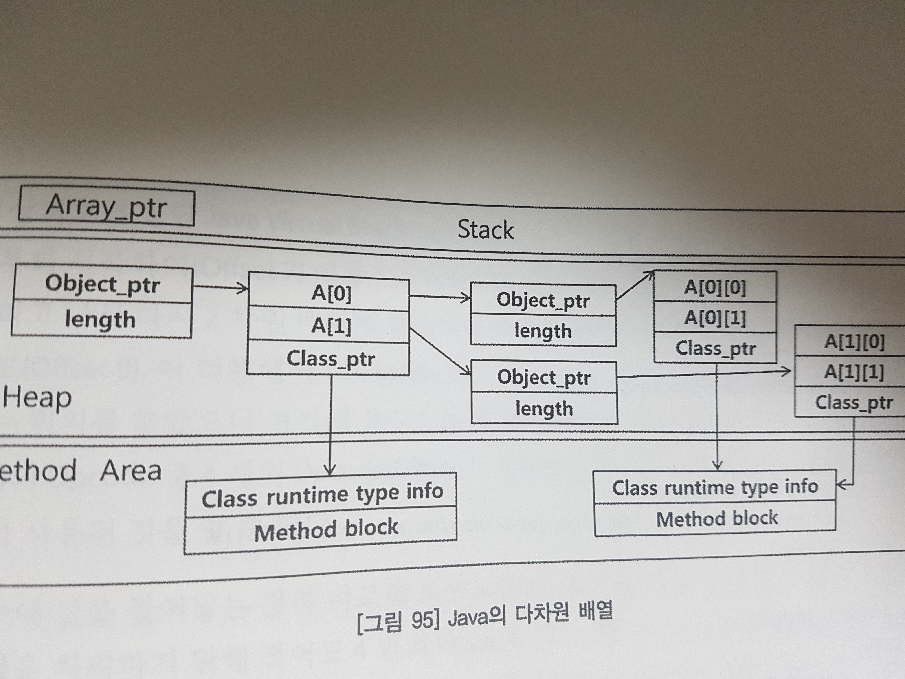

# Execution Engine
## Execution Engine 이란?
Class Loader를 통해 Load된 Class의 Byte Code를 실행하는 Runtime Module 이다.  
자바 코드 실행 과정에 관한 앞선 내용들을 다시 살펴보면, 아래와 같다.  

  

1. 소스 코드(.java)를 javac로 컴파일하여 Bytecode(.class) 생성
2. Class Loader가 Class Bytecode를 JVM으로 Load 및 Linking
3. Execution Engine이 Bytecode를 instruction code로 전환하며, 이 때 interpreter 또는 JIT Compiler가 사용 됨

## Execution Engine의 방식
Java는 Bytecode가 JVM에서 바로 수행되지 않는 구조로 설계가 되었기 때문에, JVM에서 바로 수행하도록 하는 과정이 필요하며 이를 수행 하는 것이 Execution Engine이다.  
즉, Execution Engine이 Bytecode(.class)를 Instruction으로 변환하여 동작을 수행한다.  
Execution Engine이 Bytecode를 해석하는 방법은 2가지가 있다.  

1. interpreter 방식  
    - Bytecode를 한 줄씩 해석하는 방식이다.  
    - Bytecode를 한 줄씩 읽으므로 해석하는 시간이 짧다는 것이 장점이다.  
    - 하지만 Interpreter의 결과물을 수행하는 실행 시간은 많이 걸린다는 단점이 있다.  

2. JIT(Just-In-Time) Compiler 방식  
    - 적절한 시점에 Compile을 수행하는 방식이다.  
    - Load된 Class에 대해 Interpreter 방식으로 동작을 하다가 반복 수행을 감지하면 적절하게 JIT Compiler가 동작하여 실행속도를 향상 시킨다.  
    - Bytecode로부터 Native Code를 생성한 뒤에 실행하는 것이 핵심이다.  
    - 실행속도가 느린 Interpreter 방식의 단점을 이렇게 극복한 것 이다.  
    - 대신에 Interpreter보다 Native Code로 변환하는 시간은 더 길어진다.   
    - Native Code는 기본적으로 Memory Cache가 이루어지기 때문에 반복 호출 시 성능이 극대화 된다.  
    - 그러나 반복 수행이 되지 않으면, 오히려 Interpreter보다 성능이 떨어질 수 있다.  

그래서 JVM은 기본적으로 Interpreter를 사용하다가 일정 기준을 넘어서게 되면 Jit Compliler를 사용한다.  
이 방법을 'Lazy Fashion'이라고 한다.  

## Execution Engine의 성능 이슈
Server Application의 경우 전체 수행시간에서 Execution Engine이 사용하는 시간은 절반이 넘고, Client Application에서는 30%이상의 시간을 소요한다.  
Application 수행 시간의 결정적인 요소라고 부를 수 있을 정도인데, Execution Engine의 성능 이슈가 발생 하는 부분을 알고 있어야 한다.  
1. Loop문에서 Bytecode를 반복 수행  
Java 코드
```java
	public void loop() {
		int num = 0;
		for(int i = 0; i < 100; i++) {
			num = num + i;
		}
	}
```  
Instruction 코드
```java
  public void loop();
    Code:
       0: iconst_0
       1: istore_1
       2: iconst_0
       3: istore_2
       4: iload_2
       5: bipush        100
       7: if_icmpge     20
      10: iload_1
      11: iload_2
      12: iadd
      13: istore_1
      14: iinc          2, 1
      17: goto          4
      20: return
```

위 instruction 코드 흐름을 그림으로 표현하면 아래와 같다. 

  
그림을 보면 offset 4~17번은 1번의 Loop를 의미하며, 한 번의 Loop문을 위해 8번의 Opcode 연산을 해야한다.   
즉, 이 예제에서의 100번의 Loop는 총 800번의 Opcode 연산을 해야하는 것을 의미한다.  


2. 다차원 배열을 지원하지 않음  
자바의 다차원 배열은 메모리 구조상 순차적인 구조를 이루지 않는다.  
즉, 다차원 배열은 아래와 같이 1차원 배열의 혼합구성으로 이루어 진다.  
  

다차원 배열은 여러 개의 1차원 배열을 혼합해서 구성하면서, 간단한 다차원 배열의 연산조차 아래와 같이 꽤 많은 양의 연산이 수행된다.  

  

하지만 Loop 또는 다차원 배열의 사용을 꺼리 필요는 없다. 그 이유는 JVM을 구현한 벤더들이 이러한 약점을 보완하기 위하여 무수히 많은 최적화 기법을 동원하고 있고, Execution Engine 자체 성능이 지속적으로 개선되고 있기 때문이다.  

## Hotspot Compiler
Hotspot Compiler의 이름의 유래는 Hotspot Compiler의 특성에서 기인한 것 이다.  
Hotspot Compiler는 Profiling을 통해 Hot Code를 구분하여 이를 집중적으로 Compile한다.  
**이는 불필요한 Compile을 회피하고 Hot Code에 Optimization을 집중할 수 있게 해 준다.**  
즉, 여러 Bytecode 가운데서 Hotspot을 골라내어 이를 집중적으로 최적화하는 Compiler이기 때문에 Hotspot이라는 명칭이 붙은 것 이다.  
여러 Bytecode 가운데서 Hotspot을 골라내는 방법을 profiling이라고 한다.  
Hotspot Compiler의 또 다른 특징은 Interpreter와 JIT Compiler의 혼합모드(Mixed Mode System)구성이 되어있다는 것 이다.  

 

먼저 Bytecode는 Interpreter를 통해 해석되고, Profiling을 거쳐 Dynamic Compile 된다.  
이후 계속해서 사용이 반복되면 Recompile을 수행한다.  
하지만 사용 횟수가 이전 같지 않다면 Compile이 번복되어 다시 Interpreter Mode로 수행된다.  

간혹 간헐적으로 집중적인 수행 후, 한참 동안 수행이 되지 않는 Methor가 있을 경우, 이런 Method의 경우 Native Code를 계속해서 Cache 하는 것은 비효율적인 Memory 사용이라고 할 수 있다.  

Hotspot JVM은 Execution Engine 관점에서 아래 그림과 같이 두 개의 VM으로 구성된다.  
  
이 두 VM의 가장 큰 차이는 Compiler이며, 이 차이로 인해 Optimization에서도 큰 차이가 있다.  

그러면 어떻게 Hotspot Compiler는 선택이 될까??  아래의 조건에 따라 선택이 된다고 한다.  
- Server VM  
    - 물리적 CPU가 2개 이상이고, 물리적 메모리가 2GB이상  
    - -server 옵션을 명시적으로 사용했을 때  
- Client VM  
    - 물리적 CPU와 물리적 메모리가 Server VM의 조건에 미치지 못 할 때  
    - -client 옵션을 명시적으로 사용했을 때  

### C1 Compiler  
빠르고, 가벼운 Otimization 과정을 가지기 때문에 Compile 시간이 비교적 짧다.  
Optimization을 위해 Value Numbering, Inlining, Class Analysis 등의 작업을 주로 수행한다.  
정적인 Compile을 수행한다. => 코드의 정형화된 패턴을 가지고 있는 부분을 대상으로 Compile한다.  

### C1 Compiler의 주요 Optimization
- Value Numbering
장황한 Code를 축약하는 기법으로 아래의 그림을 보면 이해가 쉽다.  
  

- Inlining
불필요한 메소드 호출을 방지하기 위해 메소드 호출부를 메소드 내용으로 변경 하는 것 이다.  
  

### C2 Compiler
같은 이름으로 'Server Compiler, Opto Compiler, High Optimizaing Bytecode Compiler, Intermediate Optimizing Compiler'이 있다. 이름에서 알 수 있듯이 강력한 Optimization을 사용하는 것으로 짐작 할 수 있다.  

### C2 Compiler의 주요 Optimization
- Common Sub-Expression Elimination  
공통된 부분을 줄이는 Optimization 방법이다.  
아래의 그림에서 공통된 부분 b * c를 tmp로 치환하여 한번만 연산하고 이를 참조하는 방식으로 바꾸는 방법을 의미한다.  
  

- Loop Unrolling  
Loop를 풀어 놓은 것을 의미한다.  
예를 들어 아래 그림과 같이 for문을 없애고, 값을 일일이 대입하는 방식으로 변환하는 것 이다.  
for문을 없애게 되면 조건을 검사하는 Opcode가 필요없게 된다.  
  

- On Stack Replacement  
Hotspot JVM이 자랑하는 Optimization 기법 중 하나이다.  
보통 Loop 내에 임계값 이상의 반복 수행이 감지되면, 다음 Loop부터는 Compile을 수행하게 된다.(일반적인 JIT Compiler)  
그러나 On Stack Replacement는 Loop를 수행하는 도중 Interpret 된 Code를 Compile을 수행하여 Compile된 코드로 대체한다.

- Array-Bounds Check Elimination  
Compiler는 Array 인덱스가 경계범위(Array-Bounds)를 벗어나게 되면, ArrayOutOfBound Exception이 발생한다.  
이를 Automatic Bounds Checking이라고 한다. Automatic Bounds Checking은 Array 접근에 대한 불안 요소를 제거 해 주기는 하지만, 인덱스가 유효한지를 지속적으로 검사하기 때문에 실행 속도에 좋지 않은 영향을 준다.  
Array-Bounds Check Elimination은 Optimization 단계에서 Array 인덱스의 최소, 최대 값을 상수화하여 사용하는 인덱스가 이 최소값과 최대값의 사이에 존재하는지만을 확인한다.

- Dead Code Elimination  
전혀 사용하지 않는 변수가 있을 경우, 아무데서도 사용하지 않으면 Compiler는 이와 관련한 코드를 Dead Code로 인식하여 Compile 단계에서 마치 처음부터 없었던 것처럼 수행에서 제외한다. 
예를 들면, 아래와 같은 코드에서 변수 sum을 포함한 Code Block이 Dead Code라고 할 수 있다.  
```java
public class KillDeadCode {
    public static void main(String[] args) {
        long before = System.currentTimeMillis();        
        int sum = 0;    // Dead Code

        for(int i = 0; i < 10 * 1000; i++) {    // Dead Code
            sum += Math.sqrt(i);                // Dead Code
        }                                       // Dead Code

        long after = System.currentTimeMillis() - before;
        System.out.println("Elapsed Time : " + Long.toString(after) + "(ms)");

    }
}
```

- Code Hoisting
Loop 내에서 항상 같은 값을 가지는 상수처럼 사용되는 Code를 Loop 바깥으로 들어내는(Hoist)것을 의미한다.  
예를 들면 아래와 같이 cos(x)와 sin(x)는 항상 동일한 값을 나타내므로, 이 두 연산은 1번만 하는 것이 좋다.  
  

- Deoptimization  
Hotspot Compiler만 가진 기능으로 사용빈도가 떨어진 Compiled Code를 Cache에서 폐기하고 다시 Interpret Mode로 수행되도록 하는 것 이다. 자원을 최적화하여 배치하는 측면에서 시스템 전반에 관한 Optimization이라고 할 수 있다.

- 기타  
Data Flow Analsis, Class Hierachy Analsis 등이 있다.

## 참조  
- On Stack Replacement(OSR)에 대한 자세한 설명 : <http://xmlandmore.blogspot.com/2012/06/on-stack-replacement-in-hotspot-jvm.html>  
- Hotspot 설명 : <http://www.oracle.com/technetwork/java/hotspotfaq-138619.html>  
- Hotspot Options : <http://www.oracle.com/technetwork/articles/java/vmoptions-jsp-140102.html>  
- Hotspot 컴파일러에서 Client VM, Server VM의 차이 : <http://stackoverflow.com/questions/198577/real-differences-between-java-server-and-java-client>  
- Hotspot JIT Compiler mode[c1, c2] : <http://www.oracle.com/technetwork/articles/java/architect-evans-pt1-2266278.html>

## 요약
- 자바의 Bytecode는 JVM에서 바로 실행되지 않는다.  
- Bytecode를 해석해서 실행 시켜주는 모듈이 Execution Engine이다.  
- Execution Engine은 Interpreter 방식과 JIT Compiler 2가지 방식으로 상황에 유연하게 해석한다.  
- JIT Compiler로 Compile 된 Native Code는 메모리에 자동 캐싱 되므로, 여러번 반복되는 코드에 적용하며 이외의 경우에는 Interpreter를 사용한다.  
- Hotspot Compiler에서의 C1, C2 Compiler는 JIT Compiler의 모드를 의미하며, Optimiaztion에서 큰 차이를 보인다. 이 두 개의 Compiler에서 Optimization을 위한 코드 분석 하는 과정을 Profiling이라고 부른다.  
- 자바7부터는 Hotspt Compiler의 두 가지 모드인 C1, C2 Compiler 모드 둘 다 사용 가능하다. 어플리케이션 시작 시에는 C1 Compiler 모드를 사용하고, 이 후 Hotspot이 감지될 쯤 C2 Compiler 모드를 사용한다. 자바 8부터는 이 기능이 default로 잡혀있다.  