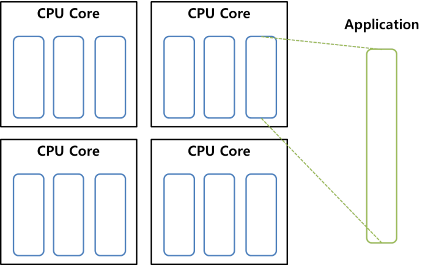
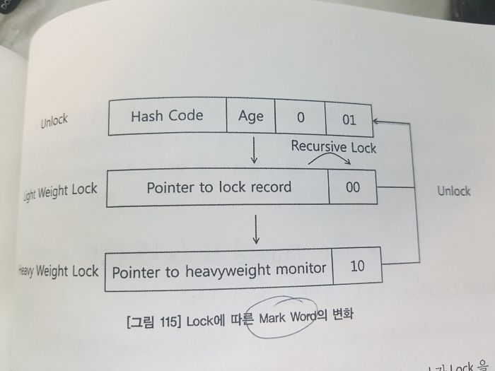
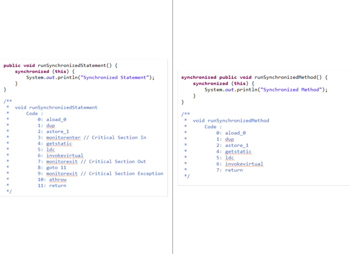
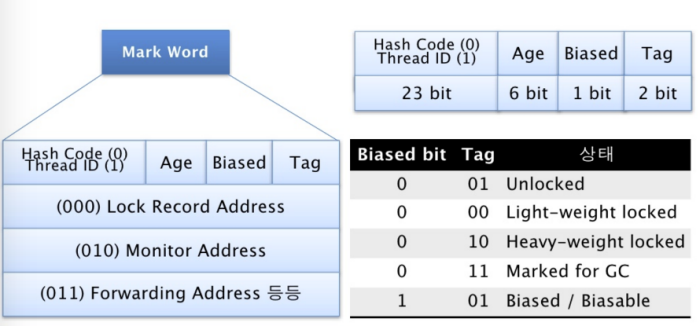
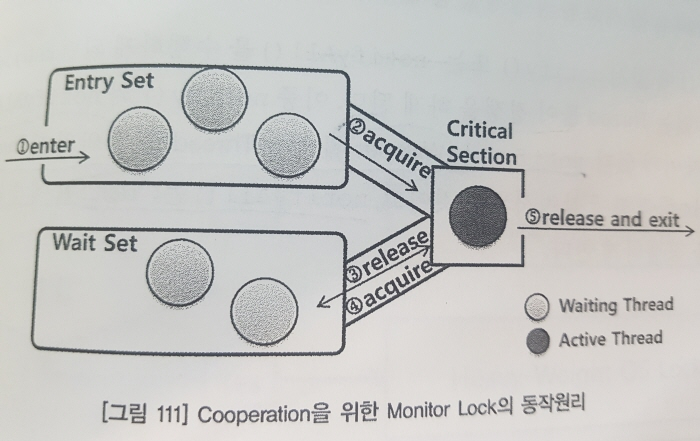

## Java의 Thread

### 1. 자바의 Thread 변천사

##### - Native Thread VS White Thread
* **Native Thread (White Thread)** : OS 가 관리하는 Thread.
* **Application Thread (Green Thread)** : 어플리케이션이 관리하는 Thread. Green Thread 는 White Thread를 1:n 으로 시분할하여 사용하는 방식.

#### - Green Thread 의 몰락

* JVM 초창기에는 Green Thread를 사용했었으나, 1.3 버전 이상부터는 Only White Thread 방식을 사용하게 됨.

* 이유 1 : 하나의 Green Thread는 하나의 Native Thread 만 이용하게 됨.
 * 멀티 코어 CPU에서는 낭비.
* 이유 2 : White Thread에 종속이 되어 있어, White Thread 가 IO 등의 작업을 하게 될 경우, 그에 종속된 Green Thread도 잠시 멈출 수 밖에 없음.

### 2. 자바 Thread의 Syncronization

* 자바는 Monitor 라고 하는 Synchronization Mechanism을 사용함. 쉽게 말해서 객체나 특정 Code Block에 걸리는 Lock.
* Mutual Exclusion 뿐만 아니라, Cooperation 을 위해서도 사용됨.

##### - Mutual Exclusion

* Mutual Exclusion : 누군가가 공유 데이터를 사용 할 때 다른 Thread 들이 사용하지 못하도록 하는것
* Mutual Exclusion 의 대상 : 쓰기가 가능한 변수들. (Read Only Value에 대해선 의미가 없다.)

##### - Cooperation

* Cooperation : 다른 Thread 간의 통신을 통해 Lock 을 점유하는 방식.
* 한 스레드가 wait 을 통해 일시적으로 Critical Section 에서 빠져나오면, 다른쓰레드가 Critical Section에 점유 할 수 있다.

* Scenario
  1. 하나의 Thread가 Critical Section 으로 들어온다. (Lock 이 잡힘)
  2. 이 Thread 는 작업을 한 후, 어떤 조건을 통해 wait() 을 호출했다. (해당 Thread 는 Wait Set 이라는 공간에서 대기하게 되고 Lock 이 풀린다.)
  3. 또다른 하나의 Thread 가 Critical Section 으로 들어온다. (Lock 이 잡힘)
  4. 해당 Thread 는 notify() 혹은 notifyAll() 을 호출한다. (Lock 이 풀리고 Wait Set에 있는 Thread 가 다시 Critical Section 으로 들어간다. 다시 Critical Section 에 Thread 가 들어왔기 때문에 Lock 이 잡힌다. )

##### - JVM의 Lock 거는 방법

* Object Lock : 한번에 한 Thread만 접근 가능하도록 만들어 놓는것. 내부적으론 Mutex와 동일하다.

##### - DBMS Lock 과 Java Lock의 차이점

* DBMS : Select의 경우에는 Lock을 획득하지 않는다. (Write 작업을 하는 DML에서만..)
* Java : 쓰기든 읽기든 Synchronization 영역에 들어가면 Lock이 잡힌다.

#### - Critical Section

* 말 그대로 Lock 을 잡기 위한 지역 (더 쉽게 설명해서 Synchronized 가 명시된 Block)
* Synchronized Statement : 블록을 통해 지정한 Critical Section
* Synchronized Method : 메소드 하나를 통째로 Critical Section으로 지정

#### - Synchronized Statement VS Synchronized Method

* Synchronized Statement 는 Byte Code에 Lock이 명시적으로 남는다.
* Synchronized Statement 는 두개의 Exit가 있다. 그 중 하나는 정상적인 동작이 완료되었을 때 Lock 을 풀어주는 의미고, 다른 하나는 Exception 이 발생했을 때 Lock 을 풀어주는 의미이다. 즉, Synchronized Statement 는 내부적으로 Try - Catch 절을 사용한 효과가 나타난다.

* Synchronized Method 는 Byte Code에 Lock이 보이지 않는다. Synchronized Method 는 Synchronized Statement 와는 다르게, Method 를 호출 자체가 Critical Section 이 된다. 즉, Method 를 호출 할 때 Lock이 잡히게 된다.
* Synchronized Method 는 Lock 의 주체를 (Synchronized Statement 로 비유하면 Synchronized(){} 에서 ()안에 들어갈 주체 ) 해당 객체 전체로 잡는다. 즉, Synchronized Method가 인스턴스 메소드라면 해당 객체, Synchronized Method 가 스테틱 메소드라면 해당 클래스를 Lock 의 주체로 잡는다.

### 3. Light Weight Lock VS Heavy Weight Lock

* Heavy Weight Lock : Monitor Lock (다른 Thread 와의 경쟁으로 발생되는 Lock)
* Light Weight Lock : Atomic Operation Lock (다른 Thread 와의 경쟁이 아닌, 자기 자신의 경쟁으로 발생하는 Lock )

### 4. Hotspot 의 Synchronization

* Heap에 저장되는 Object 의 첫번째 Header 의 Mark Word 가 붙는다.
* Hotspot JVM은 이 Mark Word를 Object Lock 을 위해서 사용한다.

* Compare And Swap (CAS) : Light Weight Lock 을 의미.

* Scenario
 1. 한 Thread 가 CAS 를 통해 특정 Object 를 사용 할 때 (첫번째 상태)
 2. 동일한 Thread 가 특정 Object에 접근하려고 할 때 (두번째 상태)
 3. 이 때 다른 Thread 들도 해당 Object 에 접근하려고 할 때 (세번째 상태)

* Biased Locking : 동일한 Thread 가 Lock을 잡으려 할 때 성능효과를 주기 위한 효과
